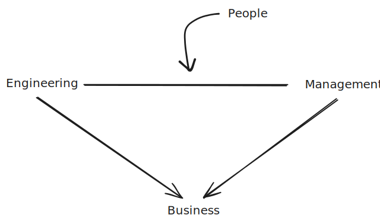

# The Role of a Manager

Source: https://frontendmasters.com/courses/intro-management/what-do-managers-do/

## What do Managers Do?

It depends.

As an engineering manager at a **fast growing startup** I spend most of my time **coding** and **hiring**.

> You are probably alone, doing the coding yourself.

As an engineering manager at a **mid sized company** I spend most of my time **mentoring** and doing **project management**.

> You are not probably hiring senior engineers because they tend to have bigger salaries, so maybe we are trying to grow quickly and you still need the junior and mid level engineers, so probably spend time mentoring and project management activities because the people on your team are not senior enough to do that themselves.

The role change from day to day, from week to week. And it depends on...

- The size of the team;
- Experience of the team;
- Scope;
- **Relation to business**: critical, with very eyes on it or in a "keep the lights on" part of the business;
- **Size of the company**: in large companies, you will spend time talking to a lot of partners, whereas in small company you will spend a lot of the time coding
- **Role of the team**: product team that build things for customers, or platform team where my customers are other engineers who work at the company;

A more broader question: **What are Engineering Managers responsible for?**

  

  Figure 1 - Everything you do will be in favor of the business

 

Sometimes you can't make people happy. When the business say you can't pay more, or if there is no room for a bigger role for example.

The challenging part of Engineering management is to make people happy while balancing all these different priorities and this does't change as you move up. At the end of the day the business pay you to operate your team efficiently, but your team is made of people and they might not care about the business as much.

## Engineer Manager Responsibilities

Management, Engineering and People.

**Management**:

- **Hiring**: a lot of paperwork, writing a good job description, interviewing and selecting candidates;
- **Termination**: a lot of paperwork, explain why, talk to HR;
- **Compensation**: paperwork, compensation, leave of absences, vendor management, purchasing, expenses, filling tickets;
- **Leave of Absence**: paperwork, time sheets and approvals;
- **Expenses, Vendor Management, Purchasing, Filling Tickets**: paperwork, someone fills out expense reports, when you buy something new or getting approvals, if we are buying software, deal with the vendor, talk to their sales representatives, look to contracts, talk to legal;

**Engineering**:

- **Charter**: what does your team do? What don't they do?
- **Communications**: setup communication channels, manage these channels, bringing and taking information from and out of the team, someone has to setup mailing lists and things like that;
- **Long Term Strategy**: elaborating and laying out the vision for the team;
- **Work Prioritization**: what to do, or not to do and when; Something came in, should we address this immediately?
- **Context Setting** style of leadership, leader leader (help to create other leaders), why are we doing things (intelligent people want to know why, you can't just tell them what to do), change management, reorganization and regrouping; Sometimes people are not ready to handle all the information. Make things relevant to people in a way that makes sense to them. Find what they care about and maybe change the context so that they understand and make it relevant;

> "when I'm forced to work on a project that I don't agree with I frame it as a demo of how my team can elevate our engineering rigor".

- **Partner and Stakeholder Management**: who are the people your team depend on, or that depend on your team? Do they know what your team is up to? Are you going to need their help in the next quarter? Do they know that? Does your team know that? Manage all these relationships. Struggle between teams;
- **Project Management**: Sometimes you need to lead technology projects when you are not the one coding;

**People**:

- **Recruiting**: for some people it is a struggle, but this is something a manager needs to get good at. Talking to strangers, explaining what your team does and why this person should work for your team or not;
- **Team Development**: are they growing as a team, picking up new skills and technology or stagnating happy where they are? Sometimes you need to develop teams, sometimes you need to let they alone;
- **Performance Coaching**: sometimes people need a nudge in the right direction; Some people are slipping and they don't know it, some people are doing it consciously and you need to figure that out and figure out what to do next and set expectations;
- **Team Health**: you are dealing with a lot of people, so you need to get along with those people; Weather they know it or not its important to have team cohesion and that is your responsibility;
- **Conflict Management**: conflicts with partner, inter team, intra team, you have to solve that. You can't avoid conflicts, instead you should run on them and figure that out;
- **Onboarding**: get people up to speed and get them productive, how do you do that? That is your responsibility.
